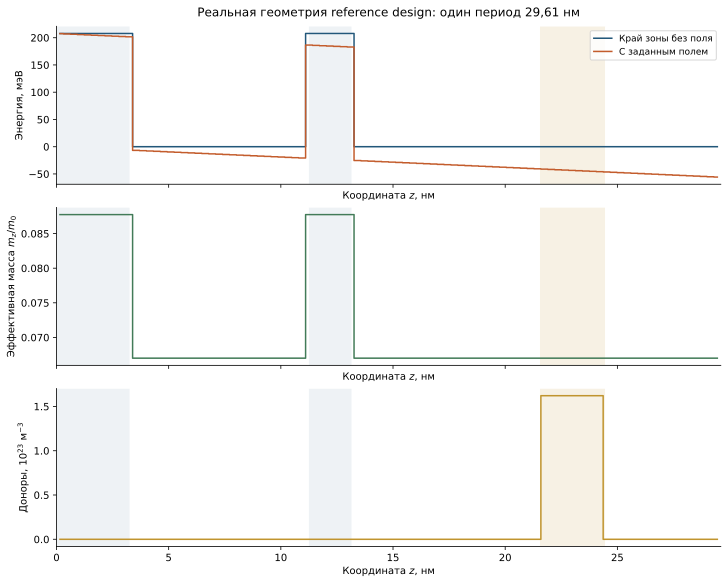

```@meta
CurrentModule = QCLNEGF
```

# [2. Паспорт reference design](@id theory-reference2019)

Активная область QCL служит конкретной геометрической задачей для
развитой в предыдущей главе модели. Высокие барьеры ограничивают движение
вдоль роста, а связь ям позволяет подбирать туннельную инжекцию и извлечение
электрона. После оптического перехода релаксация с испусканием продольного
оптического фонона помогает освободить нижнее состояние. Избыточное обратное
заполнение этого состояния при нагреве уменьшает инверсию населённостей.



*Геометрия повторяет последовательность слоёв из работы «Thermoelectrically cooled THz quantum cascade laser operating up to 210 K» (DOI 10.1063/1.5110305);
показанные материальные параметры являются входами модели, а не результатом
подгонки самосогласованного тока. Источник геометрии — [литература](@ref physics-references).*

Один период GaAs/Al``_{0.25}``Ga``_{0.75}``As начинается с инжекционного
барьера:

```math
\mathbf{32.6}/79.9/\mathbf{19.0}/84.0/\underline{29.0}/51.6\;\text{Å}.
```

| ``z`` (nm) | ``d`` (nm) | материал | назначение |
|---:|---:|---|---|
| 0.00–3.26 | 3.26 | AlGaAs | инжекционный барьер |
| 3.26–11.25 | 7.99 | GaAs | первая яма |
| 11.25–13.15 | 1.90 | AlGaAs | лазерный барьер |
| 13.15–21.55 | 8.40 | GaAs | вторая яма |
| 21.55–24.45 | 2.90 | GaAs | легированный участок |
| 24.45–29.61 | 5.16 | GaAs | вторая яма |

Физические интерфейсы с шероховатостью (interface roughness, IFR):
``0,3.26,11.25,13.15`` nm. Границы легированного участка не являются
границами материалов и не входят в IFR.

Базовый набор [`reference_parameters`](@ref) задаёт точное

```math
N_D^{2D}=4.5\times10^{14}\;\mathrm{m^{-2}},\quad
V_p=56\;\mathrm{mV},\quad
F_{bias}=V_p/L_p=18.9125\;\mathrm{kV/cm},\quad T_L=T_{LO}=200\;\mathrm K,
```

```math
\Delta E_c=207.75\;\mathrm{meV},\quad
m_w=0.067m_0,\quad m_b=0.08775m_0,
\quad \hbar\omega_{LO}=36.7\;\mathrm{meV}.
```

При ``N_z=198`` сетка с узлами в центрах ячеек даёт числа ячеек
`[22,53,13,56,19,35]`. Точная дискретная нормировка легированного участка:

```math
N^+_{D,g}=\frac{N_D^{2D}\chi_{D,g}}
{\sum_{g'}w_{g'}^{(z)}\chi_{D,g'}},
```

даёт ``1.5837466\times10^{23}\,\mathrm{m^{-3}}`` в ячейках Julia
145–163. Континуальное ``1.5517\times10^{23}\,\mathrm{m^{-3}}`` остаётся
только справочным. Реализация: [`build_profiles`](@ref).

## Что проверяется сравнением с экспериментом

Сумма толщин даёт период 29.61 nm. Нельзя считать легированный участок
отдельной квантовой ямой: материал по обе стороны его границы совпадает.
Проверка этой геометрии предшествует [локализации](@ref theory-basis),
поскольку ошибка на один слой изменяет уровни и матричные элементы всех
механизмов рассеяния.

Паспорт фиксирует геометрию и рабочую точку, но не обещает воспроизведения
экспериментального порога или максимальной температуры генерации. Сначала
следует получить устойчивые спектральные карты и ток, проверить
[балансы](@ref theory-observables), затем уточнить сетки и сравнить модели
рассеяния. Для оптических величин дополнительно учитываются ограничения
[отклика без вершинных поправок](@ref theory-optical-response).
