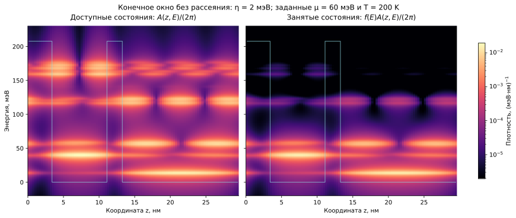

```@meta
CurrentModule = QCLNEGF
```

# [7. Функции Грина, спектр и заполнение](@id theory-greens)

Спектральная функция показывает, какие энергии доступны электрону с
заданным поперечным импульсом. Меньшая функция Грина показывает, какая
часть этого спектра занята. Они совпадают с обычным набором дискретных
уровней только в пределе исчезающего уширения. При туннельной связи и
рассеянии существенны также внедиагональные элементы, описывающие
когерентность — фазовую корреляцию амплитуд разных базисных состояний.



*Учебный спектральный пример на реальной геометрии построен с явно заданным
уширением и распределением, а не взят из сошедшегося транспортного запуска.
Параметры указаны в [атласе](@ref physical-atlas).*

## [Запаздывающее уравнение Дайсона](@id eq-dyson-retarded)

В [безразмерных единицах](@ref theory-scaling)

```math
D^R_{em}=\varepsilon_e I-h_m-\sigma^R_{em},\qquad
g^R_{em}=(D^R_{em})^{-1},\qquad g^A=(g^R)^\dagger.
```

Вещественная часть собственной энергии сдвигает резонанс, отрицательная
мнимая часть создаёт конечное время жизни. Для одного уровня
``\sigma^R=\Delta-i\Gamma/2`` спектральная линия имеет вид

```math
A(E)=i(G^R-G^A)=\frac{\Gamma}
{(E-E_a-\Delta)^2+(\Gamma/2)^2}.
```

Её интеграл ``\int A\,dE/(2\pi)=1`` выражает сохранение одного состояния.
Матричный аналог положителен полуопределённо. [`retarded_green`](@ref)
вычисляет независимые полные блоки по ``(E,k)`` и их обусловленность.

## [Уравнение Келдыша](@id eq-keldysh)

Распределение определяется инжекцией и рассеянием:

```math
g^<=g^R\sigma^<g^A,\qquad g^>=g^R-g^A+g^<.
```

В тепловом равновесии ``G^<=if(E)A`` и
``G^>=-i[1-f(E)]A``, где ``f`` — функция Ферми. Под конечным напряжением
единой функции Ферми для всей структуры обычно нет; её нельзя подставить
вместо решения кинетической задачи. Матрица ``-iG^<`` описывает занятый
спектральный вес. Формулы реализуют [`keldysh_green`](@ref),
[`greater_green`](@ref) и [`spectral_function`](@ref).

## [Число частиц и нормировка](@id eq-number-normalization)

В периодической модели число электронов задаётся ионизованной листовой
дозой доноров. Функционал

```math
\mathcal N[g^<]=-ig_s\sum_{em}\frac{\bar w_e^{(E)}}{2\pi}
\bar w_m^{(k)}\operatorname{Tr}g^<_{em}=\bar N_D^{2D}
```

учитывает спиновое вырождение ``g_s=2``. Для сырого отображения Келдыша
вводится ``\lambda=\mathcal N[\widetilde g^<]/\bar N_D^{2D}``.
Физическая неподвижная точка удовлетворяет одновременно ``\lambda=1``
и исходному уравнению Келдыша.

Для поддержания заданного числа частиц между итерациями используются
положительные корреляции ``G^n=-iG^<`` и ``G^p=iG^>``. Они вычисляются
напрямую по соответствующим собственным энергиям. Пусть N и P — их
интегральные веса, а Nt — целевое число электронов. При N>Nt выбирается
``a=N_t/N`` и выполняется

```math
(G^n,G^p)\mapsto(aG^n,\;G^p+(1-a)G^n).
```

При N<Nt выбирается ``b=(N_t-N)/P`` и выполняется

```math
(G^n,G^p)\mapsto(G^n+bG^p,\;(1-b)G^p).
```

Если исходные корреляции положительны и ``0\le a,b\le1``, оба
преобразования сохраняют положительность и сумму корреляций. Это ограничение
итерационного отображения, а не предположение о неравновесной Ферми-функции.
При N=Nt поправка исчезает. Сырые невязки и спектральное тождество
по-прежнему проверяются независимо.

Прежняя скалярная нормировка [`normalize_lesser`](@ref) делит только
``G^<`` на λ и доступна в явно выбранном legacy-режиме. При λ<1 она
может нарушить условие ``G^n\preceq A``, даже если занятая матрица
сама остаётся положительной. Подробнее — [физические ограничения](@ref theory-limitations)
и [критерии](@ref convergence-policy).

## [Координатная плотность](@id eq-realspace-density)

Проекция занятого спектра в координату даёт

```math
\bar n_g=-ig_s\sum_{emab}\bar w_m^{(k)}
\frac{\bar w_e^{(E)}}{2\pi}\chi_{ga}g^<_{emab}\chi^*_{gb}.
```

Множители ``\chi`` имеют нормировку из [главы 4](@ref theory-scaling).
Сохранение всех ``a,b`` необходимо: интерференция влияет на пространственный
заряд и поэтому на поле Хартри. Диагональная сумма населённостей является
другим приближением, если когерентности ненулевые.
[`electron_density`](@ref) передаёт эту плотность в [Пуассон](@ref theory-outer-loop).

Энергетически разрешённая координатная карта получается до суммирования по
``E``. Спектральная карта строится аналогично из ``A``. Отношение двух карт
может быть полезной локальной диагностикой заполнения, но деление на малый
спектральный вес неустойчиво и не создаёт универсальной температуры электрона.
