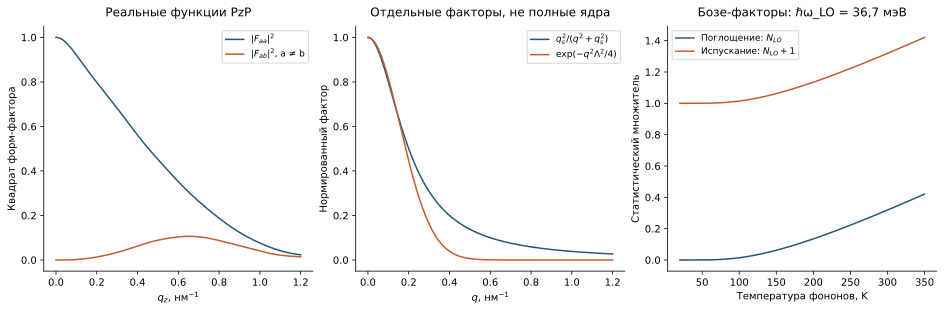

```@meta
CurrentModule = QCLNEGF
```

# [8. Микроскопические ядра](@id theory-kernels)

Рассеяние возникает из флуктуаций потенциала: движения атомов, случайных
положений примесей или отклонений интерфейса. Средний матричный элемент
случайного потенциала может быть нулевым, но средний квадрат остаётся
ненулевым и определяет вероятность переходов. Именно этот второй момент
хранит ядро ``K``. При ансамблевом усреднении коррелируются две вершины
``a←c`` и ``b←d``; поэтому ядро имеет четыре базисных индекса,
а не таблицу независимых вероятностей между парами уровней.

Передача поперечного импульса равна
``q=\sqrt{k^2+k'^2-2kk'\cos\varphi}``. Усреднение по углу не заменяет
явной радиальной зависимости от ``k,k'``. Общий вывод борновских
собственных энергий обсуждается в [литературе](@ref physics-references).

Все ядра имеют единицу ``E_0^2L_0^2`` до масштабирования и один порядок
индексов ``K_{mm'ac;db}``. Составная ковариационная матрица определяется как
``M_{(a,c),(b,d)}=K_{ac;db}`` и обязана быть эрмитовой положительно
полуопределённой.

## [EQ-KIMP-001 — ионизованные примеси](@id eq-impurity-kernel)

Ионизованный донор создаёт кулоновское поле. Его большие пространственные
масштабы соответствуют малой передаче импульса, где экранирование особенно
существенно. Параметр ``q_s`` задаёт обратную длину статического
экранирования в принятой модели; его изменение является изменением
взаимодействия, а не только способом улучшения численной сходимости.
При положении донора ``z_D`` проекция потенциала равна

```math
V^{imp}_{ac}(q;z_D)=\frac{e^2}{2\epsilon_0\epsilon_s(q+q_s)}
\int dz\,\psi_a^*e^{-q|z-z_D|}\psi_c,
```

```math
K^{imp}_{ac;db}(q)=\int dz_D\,N_D^+(z_D)
V^{imp}_{ac}(q;z_D)V^{imp*}_{bd}(q;z_D).
```

Реализация: [`impurity_kernel`](@ref). Массив доноров совпадает с массивом в
уравнении Пуассона.

## [EQ-KIFR-001 — шероховатость интерфейсов](@id eq-ifr-kernel)

Пусть смещение интерфейса ``j`` по нормали имеет среднеквадратичную
амплитуду ``\Delta_j`` и гауссову корреляционную длину ``\Lambda_j``.
Сдвиг ступеньки зоны создаёт вершину
``D^{(j)}_{ac}=\Delta E_{c,j}\psi_a^*(z_j)\psi_c(z_j)``.
Двумерное преобразование Фурье коррелятора даёт спектральную плотность

```math
S_j(q)=\pi\Delta_j^2\Lambda_j^2e^{-q^2\Lambda_j^2/4},\qquad
K^{IFR}_{ac;db}=\sum_jS_jD^{(j)}_{ac}D^{(j)*}_{bd}.
```

Граница ``z=0`` учитывается один раз справа. Реализация:
[`interface_roughness_kernel`](@ref).

## [EQ-KAC-001 — акустическое равнораспределение](@id eq-acoustic-kernel)

Акустическая деформация меняет край зоны через деформационный потенциал
``\Xi``. Когда энергия существенных акустических фононов мала относительно
``k_BT_L``, их заполнение приближённо пропорционально температуре, а
столкновение считается упругим. При плотности материала ``\rho_m`` и
скорости звука ``v_s`` получается

```math
K^{ac}_{ac;db}=\frac{\Xi^2k_BT_L}{\rho_mv_s^2}
\int dz\,\psi_a^*\psi_c\psi_d^*\psi_b.
```

Реализация: [`acoustic_kernel`](@ref). [`alloy_kernel`](@ref) использует тот
же интеграл по четырём волновым функциям, но канал базового набора равен
точному нулю.

## [EQ-KALLOY-001 — беспорядок в сплаве](@id eq-alloy-kernel)

В тройном сплаве случайная замена атомов создаёт короткодействующий
беспорядок. Для независимых узлов дисперсия состава пропорциональна
``x_{Al}(1-x_{Al})``. Элементарный объём ``\Omega_0`` и энергетический
контраст ``\Delta V_{alloy}`` должны быть явно заданы:

```math
K^{alloy}_{ac;db}=\Omega_0(\Delta V_{alloy})^2
\int dz\,x_{Al}(z)[1-x_{Al}(z)]
\psi_a^*\psi_c\psi_d^*\psi_b.
```

Канал разрешается только когда одновременно заданы ``\Omega_0`` и
``\Delta V_{alloy}``; иначе базовый набор хранит его выключенным, а не подставляет
неявный материал.

## [EQ-KLO-001 — полярные LO-фононы](@id eq-lo-kernel)

В полярном кристалле продольное оптическое колебание создаёт электрическое
поле. Взаимодействие Фрёлиха поэтому зависит от разности обратных
высокочастотной и статической диэлектрических проницаемостей
``\epsilon_\infty^{-1}-\epsilon_s^{-1}``. Продольный форм-фактор
измеряет перекрытие электронных состояний с пространственной гармоникой
фонона:

```math
F_{ac}(q_z)=\int dz\,\psi_a^*e^{iq_zz}\psi_c,
```

```math
K^{LO}_{ac;db}(q)=\frac{e^2\hbar\omega_{LO}}{2\epsilon_0}
\left(\epsilon_\infty^{-1}-\epsilon_s^{-1}\right)
\int\frac{dq_z}{2\pi}\frac{F_{ac}F_{bd}^*}
{q^2+q_z^2+q_{LO,s}^2}.
```

Число равновесных фононов равно
``N_{LO}=[\exp(\hbar\omega_{LO}/k_BT_{LO})-1]^{-1}``.
Множитель ``N_{LO}+1`` содержит спонтанное и стимулированное испускание,
а ``N_{LO}`` — поглощение. Поэтому LO-канал переносит энергию между
электронами и термостатом; упругие каналы сами по себе такого отвода энергии
не обеспечивают. Меньшая компонента использует
``(N_{LO}+1)G^<(E+\hbar\omega)+N_{LO}G^<(E-\hbar\omega)``; большая —
противоположные сдвиги. Реализация: [`lo_phonon_kernel`](@ref).



*Факторы равновесного заполнения LO и гауссовой шероховатости иллюстрируют
зависимость от температуры и импульса. Для конкретных переходов их нужно
умножить на форм-факторы реального базиса; см. [атлас](@ref physical-atlas).*

## [EQ-CONTRACT-001 — статическая четырёхиндексная свёртка](@id eq-static-contraction)

```math
\Sigma^{x,s}_{emab}=q_s^K\sum_{m'=1}^{N_k}w_{m'}^{(k)}
\sum_{c,d=1}^{N_b}\widehat K^s_{mm'ac;db}G^x_{em'cd},
\qquad x\in\{<,>\}.
```

## [EQ-CONTRACT-LO-001 — меньшая и большая компоненты LO](@id eq-lo-contraction)

```math
\Sigma^{<,LO}(E)=q_{LO}^K\mathcal K_{LO}
\left[(N_{LO}+1)G^<(E+\hbar\omega_{LO})
+N_{LO}G^<(E-\hbar\omega_{LO})\right],
```

```math
\Sigma^{>,LO}(E)=q_{LO}^K\mathcal K_{LO}
\left[(N_{LO}+1)G^>(E-\hbar\omega_{LO})
+N_{LO}G^>(E+\hbar\omega_{LO})\right].
```

Здесь ``\mathcal K_{LO}`` означает ровно сумму предыдущего раздела по
``m',c,d`` с `KernelSet.K[:LO]`; усреднения по импульсу нет.

## [Причинность и преобразование Гильберта](@id eq-direct-hilbert)

Запаздывающая реакция не может иметь независимо выбранные вещественную и
мнимую части. Причинность связывает дисперсионный сдвиг ``\Lambda`` с
уширением ``\Gamma`` соотношением Крамерса—Кронига:

```math
\Gamma=i(\Sigma^>-\Sigma^<),\qquad
\Lambda(E)=\mathcal P\int\frac{dE'}{2\pi}
\frac{\Gamma(E')}{E-E'},\qquad
\Sigma^R=\Lambda-i\Gamma/2.
```

Символ ``\mathcal P`` означает главное значение: вклады с двух сторон
сингулярной точки берутся согласованно. В режиме `direct` используется
дискретная сумма с опущенной диагональю; `fft` ускоряет **эту же сумму**:


```math
\Gamma=i(\Sigma^>-\Sigma^<),\quad
\Lambda_e=\sum_{e'\ne e}\frac{w_{e'}^{(E)}}{2\pi}
\frac{\Gamma_{e'}}{E_e-E_{e'}},\quad
\Sigma^R=\Lambda-i\Gamma/2.
```

Режим `product_integration` вместо этого аналитически интегрирует
кусочно-линейную аппроксимацию уширения по каждому энергетическому
интервалу с вычитанием сингулярности. За каждым концом окна добавляется
линейный спад к нулю на одном дополнительном узле. Это объявленное
продолжение за границу, не вычисленный физический хвост. Точность
интегрирования и ширина окна должны уточняться независимо.

Для примесного канала `kernel_build: adaptive_direct` разрешает острый
угловой вклад заменой ``\varphi=\pi u^2`` и адаптивной квадратурой
Симпсона с положительными весами. Оценка разности квадратур не является
строгой априорной границей ошибки; результат требует независимого
уточнения. Она не сертифицирует квадратуры LO и шероховатости автоматически.

Реализация дискретной суммы: [`direct_hilbert_transform`](@ref),
[`retarded_self_energy`](@ref). Отрицательные собственные значения диагностируются до решения о приёмке;
их отсечение изменило бы оператор. Скалярная нормировка ``q_s^K`` разобрана
в [главе о масштабах](@ref eq-kernel-rescale), а влияние приближений на
неподвижную точку — в [главе о методах](@ref optimization-decision-tree).

## [EQ-SELFENERGY-001 — тождество Келдыша для запаздывающей компоненты](@id eq-retarded-selfenergy)

Для каждого ``(e,m)`` дополнительно проверяется

```math
\Sigma^R-\Sigma^{R\dagger}=\Sigma^>-\Sigma^<,
\qquad \operatorname{Im}_H\Sigma^R=-\Gamma/2\preceq0.
```
