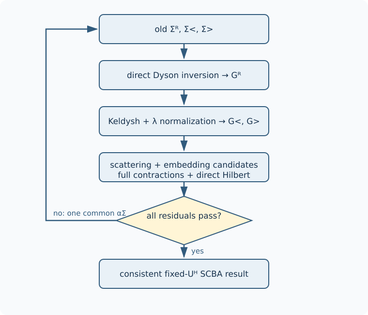
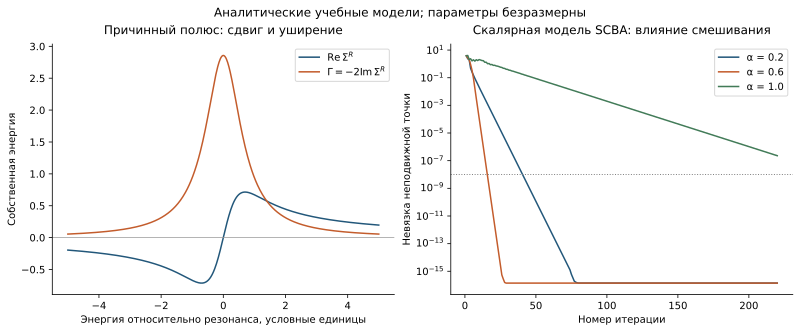

```@meta
CurrentModule = QCLNEGF
```

# [9. Самосогласованное борновское приближение](@id theory-scba)

Борновское приближение сохраняет ведущий ненулевой вклад вероятности
рассеяния, квадратичный по матричному элементу взаимодействия. В
самосогласованном варианте этот вклад вычисляется через уже уширенные и
заполненные функции Грина. Поэтому собственная энергия зависит от функции
Грина, которая сама зависит от собственной энергии. Английское сокращение
SCBA обозначает именно это самосогласованное борновское приближение.

При фиксированном поле Хартри задача имеет вид ``\Sigma=\mathcal F[\Sigma]``.
Итерации ищут неподвижную точку отображения ``\mathcal F``; их номер не
является физическим временем релаксации электрона.



## [Одновременное отображение и смешивание](@id eq-scba-map)

Один шаг сначала решает Дайсон и Келдыш по текущим собственным энергиям,
затем согласованно нормирует занятые и незанятые корреляции. Большая функция
Грина вычисляется прямым произведением и проверяется по спектральному тождеству. Из **одной
и той же** тройки ``(G^R,G^<,G^>)`` строятся кандидаты всех механизмов и
вложения соседей. Только после завершения этих операций выполняется
смешивание:

```math
\Sigma^x_{s,\nu+1}=(1-\alpha_\Sigma)\Sigma^x_{s,\nu}
+\alpha_\Sigma\widehat\Sigma^x_{s,\nu+1},\qquad 0<\alpha_\Sigma\le1.
```

Здесь ``x\in\{R,<,>\}``, ``s`` обозначает семейство собственной энергии.
Общее смешивание всех компонент сохраняет линейные тождества между ними.
Обновление одного механизма до вычисления остальных означало бы другое
отображение. Реализации [`solve_scba`](@ref) и
[`solve_scba_production`](@ref) используют эту согласованную семантику.

Невязка неподвижной точки определяется по **несмешанному** кандидату.
Разность двух смешанных итераций равна
``\alpha_\Sigma(\widehat\Sigma-\Sigma)`` и искусственно уменьшается при
малой ``\alpha_\Sigma``. Поэтому её одной недостаточно для приёмки.
Сохранённые ``G`` и ``\Sigma`` относятся к одному состоянию до следующего
смешивания; контрольная точка не должна соединять данные соседних шагов.

## Почему медленное смешивание иногда помогает

Около решения ``\Sigma_*`` линеаризация даёт

```math
\delta\Sigma_{\nu+1}\simeq
[(1-\alpha_\Sigma)I+\alpha_\Sigma\mathcal F'(\Sigma_*)]
\delta\Sigma_\nu.
```

Для сходимости спектральный радиус этой матрицы должен быть меньше единицы.
Демпфирование может подавить колебательные направления, но не гарантирует
сжатия произвольного нелинейного отображения. Узкие резонансы, энергетические
границы, длинноволновое примесное рассеяние и изменение нормировки способны
сильно менять производную отображения.



*Иллюстрация показывает действие смешивания на модельное отображение;
это не измеренная траектория сходимости QCL. Подробности — в
[атласе](@ref physical-atlas).*

Метод Андерсона комбинирует несколько предыдущих невязок, решая малую
задачу наименьших квадратов. Он меняет способ поиска решения, но не его
уравнения. История ограничена, плохо обусловленная комбинация отклоняется,
а физическая допустимость следующего состояния проверяется независимо;
см. [сравнение методов](@ref optimization-decision-tree).

## Строгая и приближённая приёмка

Строгая приёмка требует одновременно невязок Дайсона, спектрального
тождества, Келдыша, собственной энергии, нормировки, положительности,
причинности и устойчивости наблюдаемых. Последовательные проходы порогов
защищают от случайного краткого пересечения. Значение порядка ``10^{-8}``
относится к определённой невязке, а не к гарантированной относительной
ошибке тока.

Если явно включена `diagnostic_quality`, подтверждённая полоса качества
порядка ``10^{-4}`` или ``10^{-3}`` допускает ранний выход со статусом
`:approximate` и предупреждением. Такое состояние может быть передано
во внешний цикл Пуассона, но `converged` остаётся ложным. Алгебраические
проверки не ослабляются, физические ограничения имеют отдельные объявленные
допуски. Падение одной невязки или визуально гладкий ток не заменяют всех
условий. Точные поля, окна подтверждения и статусы изложены в
[политике сходимости](@ref convergence-policy).

Превышение бюджета, недопустимый кандидат и застой остаются различными
причинами завершения. Увеличение числа итераций полезно только когда
диагностика показывает продолжающееся уменьшение остаточной ошибки;
до этого следует проверить [окна и замыкание](@ref theory-periodicity),
[квадратуры](@ref theory-kernels) и [базис](@ref theory-basis).
