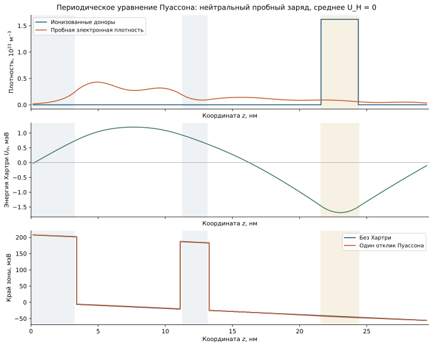
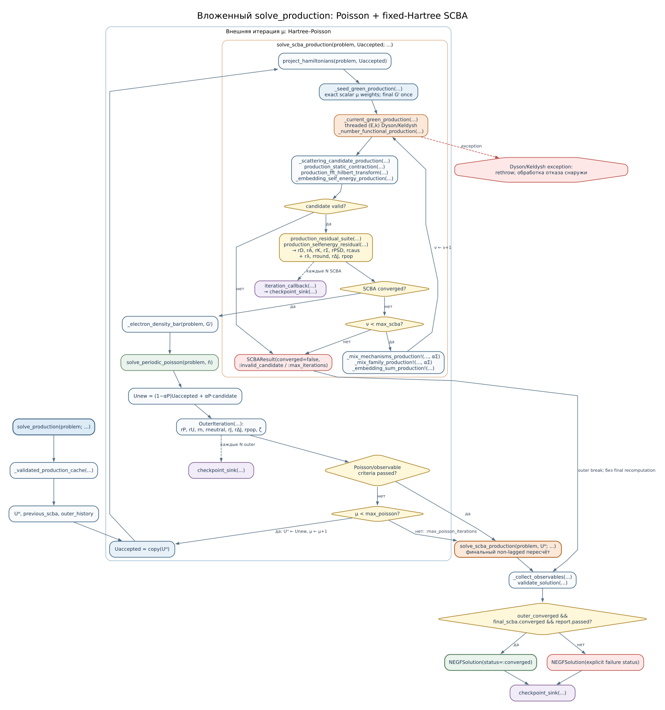

```@meta
CurrentModule = QCLNEGF
```

# [10. Поле Хартри и периодическая задача Пуассона](@id theory-outer-loop)

Электронный заряд изменяет потенциальную энергию других электронов. В
приближении Хартри учитывается среднее электростатическое поле плотности,
без обмена и корреляционных столкновительных поправок. Для положительной
плотности ионизованных доноров ``N_D`` и электронной плотности ``n``
объёмный заряд равен ``\rho=e(N_D-n)``. Уравнение электростатики
``\partial_z(\epsilon_0\epsilon_r\partial_z\phi_H)=-\rho`` и
``U_H=-e\phi_H`` дают знак источника, используемый ниже.



*Демонстрация использует заданное нейтральное возмущение заряда на профиле
материалов QCL. Она проверяет ответ Пуассона, а не заменяет электронную
плотность из полного NEGF-расчёта; см. [атлас](@ref physical-atlas).*

## [Дискретный оператор конечных объёмов](@id eq-poisson-matrix)

Поток электрического смещения вычисляется на гранях ячеек. При равномерном
шаге ``\Delta x`` матрица, представляющая
``-\partial_x\epsilon_r\partial_x``, имеет элементы

```math
(L_P)_{gg}=\frac{\epsilon_{g-1/2}+\epsilon_{g+1/2}}{\Delta x^2},\qquad
(L_P)_{g,g\pm1}=-\frac{\epsilon_{g\pm1/2}}{\Delta x^2}.
```

Периодические угловые элементы соединяют первую и последнюю ячейки.
[`build_poisson_matrix`](@ref) сохраняет постоянный вектор в ядре:
электростатика определяет разности потенциалов, но не их общий нуль.
Суммирование уравнения по ячейке также показывает условие разрешимости:
``\int(N_D-n)dz=0``. Это физическая нейтральность периодического периода.

## [Фиксация калибровки](@id eq-bordered-poisson)

Чтобы выбрать единственный потенциал, задаётся нулевое среднее. Решается
окаймлённая система

```math
\begin{bmatrix}L_P/s_P&v\\v^T&0\end{bmatrix}
\begin{bmatrix}u_H\\\bar\zeta\end{bmatrix}
=\begin{bmatrix}-\lambda_P(\bar N_D-\bar n)/s_P\\0\end{bmatrix},
\qquad v_g=N_z^{-1/2}.
```

Скаляр ``s_P`` масштабирует матрицу, а множитель ``\bar\zeta`` контролирует
компоненту источника вдоль нулевой моды. Ненулевой множитель сигнализирует
несогласованный суммарный заряд. [`solve_periodic_poisson`](@ref) не
вычитает его среднее из источника: такое действие скрыло бы ошибку
[нормировки числа частиц](@ref theory-greens).

## [Внешнее отображение неподвижной точки](@id eq-outer-map)

При заданном ``u_H^{(\mu)}`` внутренний решатель получает стационарную
электронную плотность. По ней Пуассон строит новый кандидат
``\widetilde u_H``. Затем

```math
u_H^{(\mu+1)}=(1-\alpha_P)u_H^{(\mu)}+
\alpha_P\widetilde u_H^{(\mu+1)}.
```

Внешнее смешивание необходимо, поскольку перенос заряда меняет уровни,
а сдвиг уровней способен снова резко изменить перенос. Его коэффициент
отдельный от смешивания собственных энергий. Внутренние и внешние невязки
нельзя объединять в один номер итерации или один физический допуск.

## [Вложенный алгоритм и согласованное конечное состояние](@id production-nested-flow)



[`solve_production`](@ref) вызывает [`solve_scba_production`](@ref),
вычисляет плотность и решает Пуассон. После приёмки внешнего отображения
выполняется финальный SCBA при **сохранённом** поле Хартри, а
[`validate_solution`](@ref) повторно проверяет источник Пуассона и балансы.
Иначе сохранённый потенциал мог бы относиться к следующей итерации,
а спектр и плотность — к предыдущей.

При включённом приближённом режиме внутренний статус `:approximate`
разрешает вычисление внешнего отображения с сохранением предупреждений.
Окончательное приближённое решение всё равно должно пройти независимые
объявленные критерии; ограничение тока или энергетического баланса не
отменяется. Финальная строгая классификация требует строгого внутреннего
решения и полного строгого отчёта. Политика изложена в
[главе о сходимости](@ref convergence-policy).

Потоки процессора используются внутри текущей операции и не изменяют
порядок физических зависимостей. Следующая итерация Хартри требует уже
принятой плотности; поэтому её нельзя вычислить параллельно с предыдущей.
[Карта исполнения](@ref production-parallel-execution) уточняет допустимые
границы распараллеливания.
