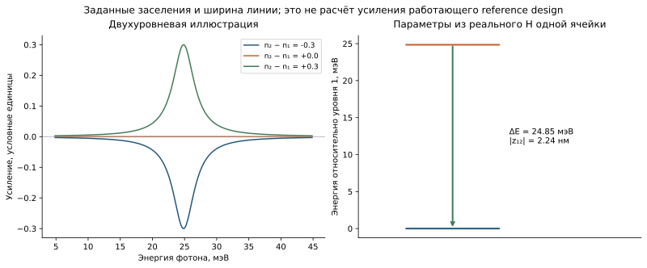

```@meta
CurrentModule = QCLNEGF
```

# [Оптический отклик: диагностика без вершинных поправок](@id theory-optical-response)

Оптическое усиление возникает, когда слабое электромагнитное поле
получает энергию от неравновесных электронов. Линейная восприимчивость
``\chi(\omega)`` связывает наведённую поляризацию с амплитудой поля:
``P_\omega=\epsilon_0\chi(\omega)F_\omega``. Её вещественная часть
описывает дисперсию, а мнимая — обмен энергией с полем. Полный расчёт
требует не только известных стационарных населённостей, но и вариации
корреляционных функций при внешнем возмущении.

Приближение без вершинных поправок означает, что оптическая вариация
самих собственных энергий положена равной нулю. В диаграммном языке такой
отклик называют «голой петлёй» (bare bubble). Ниже это название относится
к конкретному оптическому приближению, а не к отсутствию рассеяния в
стационарных функциях Грина.



*График атласа показывает явно заданный модельный отклик; его амплитуда
не является вычисленной характеристикой экспериментального лазера QCL.*

Целевой для reference design диапазон энергии фотона — примерно ``10\ldots20`` meV;
в статье максимум расположен около ``16.5`` meV. Функция
[`bare_bubble_optical_response`](@ref) вычисляет малосигнальный материальный
коэффициент усиления непосредственно из полностью матричных стационарных ``G^R_{em,ab}`` и
``G^<_{em,ab}``. Она не подменяет спектральное уширение лоренцевой линией и не
извлекает населённости отдельных уровней.

Для гармонической зависимости ``\exp(-i\omega t)`` и
``\delta U=eF_\omega z`` отклик Келдыша без вершинных поправок равен

```math
\delta G^<_{m}(E;\omega)=
G^R_m(E+\hbar\omega)\delta U G^<_m(E)
+G^<_m(E+\hbar\omega)\delta U G^A_m(E).
```

Индекс ``m=1,\ldots,N_k`` обозначает радиальный узел
``k_{\parallel,m}``, ``e=1,\ldots,N_E`` — энергетический узел, а
``a,b=1,\ldots,N_b`` — состояния фиксированного локализованного базиса.
Сдвиг ``E_e+\hbar\omega`` интерполируется линейно без циклического замыкания.

В безразмерных переменных проекта при ``F_{ref}=1`` V/m

```math
\delta\widehat U=
\frac{eF_{ref}L_0}{E_0}\,Z,
```

```math
\delta\bar\rho=
-i\frac{g_s}{2\pi}\sum_{e=1}^{N_E}\sum_{m=1}^{N_k}
w^E_e w^k_m\,\delta G^<_{em},
```

```math
\chi(\omega)=
\frac{-e}{\epsilon_0F_{ref}L_pL_0}
\operatorname{tr}\!\left(Z\delta\bar\rho\right).
```

Здесь ``Z_{ab}`` — полная плотная эрмитова матрица координаты в единицах
``L_0``; ``\delta G^<_{em}`` — полная плотная комплексная матрица
``N_b\times N_b``; ``\delta\bar\rho`` — полная плотная комплексная матрица
той же размерности; ``\chi`` безразмерна. Материальный коэффициент усиления по интенсивности

```math
\widetilde n(\omega)=\sqrt{\epsilon_b+\chi(\omega)},\qquad
g(\omega)=-\frac{2\omega}{c}\operatorname{Im}\widetilde n(\omega),
```

возвращается в ``\mathrm{m}^{-1}``; положительный знак означает усиление,
отрицательный — поглощение. [`peak_gain`](@ref) извлекает максимум только из
доверенных точек, если явно не задано обратное.

## Область применимости линейного отклика

Это диагностический, а не количественно сохраняющий коэффициент усиления из
статьи QCL. Положено ``\delta\Sigma^{R,<}=0``: лестничные и вершинные
поправки отсутствуют. Также не включены межпериодные блоки оператора дипольного
момента, электрон-электронное рассеяние, отклик Пуассона с участием фотонов и
коэффициент оптического ограничения. Полный самосогласованный линейный отклик
меняет абсолютный коэффициент усиления; в частности, в самой статье указано,
что упрощённый канал электрон-электронного рассеяния почти вдвое уменьшает
усиление при 200 K и даёт красный сдвиг примерно 1 meV. Поэтому спектр без
вершинных поправок можно использовать для проверки положения пика и трендов,
но нельзя выдавать за опубликованный абсолютный коэффициент усиления.

Каждая точка содержит `edge_loss`: симметричную оценку источника и приёмника по
спектральному весу ``A(E)+A(E+\hbar\omega)`` для пар, которые вышли за
энергетическое окно либо затронули краевую зону вне доверенной маски
преобразования Гильберта. Это
консервативная диагностика чувствительности окна, но не строгая верхняя
граница отброшенного оптического подынтегрального выражения. `trusted=true` требует одновременно
``\hbar\omega\le M_E`` и
`edge_loss <= edge_tolerance`. Для итогового графика надо показать
``g(\hbar\omega)`` вместе с отметкой недоверенных точек и повторить расчёт на
расширенном энергетическом окне.

## Материальное усиление и генерация

Коэффициент ``g`` относится к интенсивности плоской волны в активном
материале. Переход от него к модальному усилению волновода требует
коэффициента оптического ограничения; условие генерации дополнительно
содержит потери резонатора. Выходная мощность не получается умножением
``g`` на ток без баланса фотонов и модели насыщения.

Равновесная система с согласованным распределением должна давать
поглощение, а модельная инверсия двух уровней — менять знак резонансного
вклада. Это полезные тесты конвенций. Количественное сопоставление со
спектрами требует независимого уточнения энергетического окна, числа
состояний, механизмов рассеяния и самого оптического приближения. Роль
вариации собственной энергии в калибровочной согласованности обсуждается
в работе Wacker из [списка литературы](@ref physics-references).
