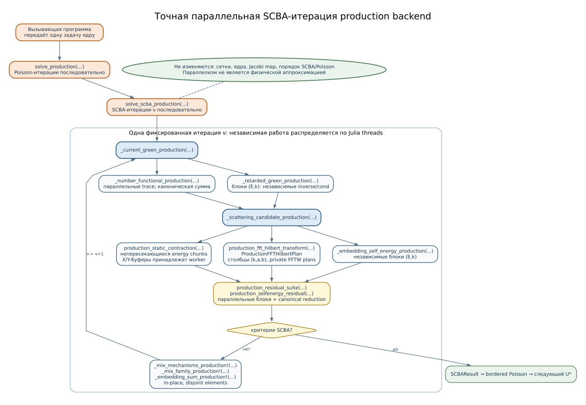

```@meta
CurrentModule = QCLNEGF
```

# [Рабочая реализация и вычислимые результаты QCL](@id theory-production)

## Граница заявленной применимости

Рабочая реализация решает замкнутую стационарную задачу
Пуассона—Дайсона—Келдыша—SCBA. Для общих дискретных операторов она
поэлементно сравнивается с учебной реализацией; новые квадратуры и
замыкания оцениваются отдельно, как описано в
[классификации методов](@ref optimization-decision-tree). Она предназначена для
трёх типов величин, представленных в работе «Thermoelectrically cooled THz quantum cascade laser operating up to 210 K» (DOI 10.1063/1.5110305):

1. профиль зоны и ``n(E,z)`` при ``T_L=200`` K и
   ``V_p=56`` мВ на период — аналог рис. 3(a);
2. вычисленная ``J(V_p)`` при ``T_L=200`` K --- NEGF-часть рис. 3(b);
3. положение и температурная зависимость усиления около
   ``\hbar\omega=16.5`` мэВ при 205 K — только диагностический отклик без
   вершинных поправок из
   [оптической главы](@ref theory-optical-response).

Стационарный транспортный решатель не вычисляет экспериментальную LI-мощность,
FTIR-спектр лазера, контактное падение напряжения или ``T_{\max}``. Для них
необходимы параметры резонатора, потери, фотонная динамика, контакты и модель
электрических доменов. Абсолютное усиление статьи также не воспроизводится без
``\delta\Sigma``, вершинных поправок и электрон-электронной собственной
энергии.

## [Статическая сборка](@id production-static-workflow)

`build_problem_production` собирает физическую задачу и диагностику ядер.
`build_production_cache` создаёт рабочие области. `solve_production` принимает
явные численные опции и возвращает `NEGFSolution` в памяти. Необязательный
`checkpoint_sink` принимает состояния через callback; он не задаёт формат файла.

Планирование серий, выбор ресурса и сохранение результата документированы в
[QCLNEGFRunner.jl](https://github.com/Afonenko-QCL-NEGF/QCLNEGFRunner.jl/tree/main/docs/src).

## Две реализации без изменения учебного эталона

[`solve`](@ref) и [`solve_scba`](@ref) оставлены буквальными: плотные
матрицы энергетического сдвига, поэлементная шестииндексная свёртка и прямая
``O(N_E^2)`` сумма главного значения. Рабочий программный интерфейс вызывается
отдельно:

```julia
cache = build_production_cache(problem)
solution = solve_production(problem; cache)
```

Таким образом, оптимизированные операторы можно на малой сетке сравнивать с
формулами, а выбор реализации никогда не является скрытым параметром.

## [Точная параллельная карта исполнения](@id production-parallel-execution)



Параллельность разрешена только внутри одной уже определённой SCBA-итерации.
При одном вызове ядра
[`solve_production`](@ref) последовательно обновляет ``U^H``, а
[`solve_scba_production`](@ref) последовательно выполняет Jacobi-итерации
``\nu``. Нельзя одновременно вычислять ``\nu`` и ``\nu+1``: второй кандидат
зависит от полностью сформированного ``G_\nu``. По той же причине в одном
процессе не распараллеливаются соседние итерации Пуассона или точки серии по
напряжению.

Внутри фиксированной итерации независимы:

- блоки ``(e,m)`` Дайсона—Келдыша в `_retarded_green_production` и
  `_current_green_production`;
- непересекающиеся диапазоны энергий в
  [`production_static_contraction`](@ref);
- столбцы ``\alpha=(m,a,b)`` дискретного преобразования Гильберта в
  [`production_fft_hilbert_transform`](@ref);
- блоковые значения невязок в [`production_residual_suite`](@ref) и
  [`production_selfenergy_residual`](@ref);
- отдельные элементы массивов при `_mix_mechanisms_production!`,
  `_mix_family_production!` и `_embedding_sum_production!`.

Все исполнители читают один и тот же принятый ``G_\nu`` и пишут
непересекающиеся элементы результата. После барьера выполняется следующий
физически зависимый этап. Сетки, полные ядра рассеяния, периодические сдвиги,
критерии сходимости и Jacobi-семантика не меняются. Следовательно,
параллельный режим не является усреднением по импульсу, усечением или иной
физической аппроксимацией; возможны только обычные различия последних битов
Float64 там, где эквивалентная формула вычисляется в другом порядке.

Схема показывает зависимости внутри одной численной итерации.

### Контракт `ProductionOptions`

[`ProductionOptions`](@ref) отделяет выбор расписания от физического
[`SolverOptions`](@ref):

| поле | исходное значение | точный смысл |
|---|---:|---|
| `parallel_backend` | `:threads` | `:threads` распределяет независимые блоки между потоками Julia при однопоточной BLAS; `:blas` передаёт матричные произведения многопоточной BLAS |
| `worker_count` | `0` | `0` разрешает планировщику использовать доступное число потоков; положительное значение является верхней границей |
| `energy_chunk` | `64` | верхняя граница числа энергий в одном вызове BLAS; автоматический план может уменьшить её ради загрузки CPU или памяти |
| `hilbert_columns` | `32` | верхняя граница числа столбцов ``(m,a,b)`` в FFT-буфере одного исполнителя |
| `residual_chunk` | `256` | верхняя граница числа блоков ``(e,m)`` в одной задаче проверки невязок |
| `phase_timing` | `false` | сохранять длительности инициализации, Дайсона—Келдыша, кандидата, невязок, наблюдаемых величин и смешивания |
| `verify_fft_roundoff` | `true` | хранить второй FFT-буфер с удвоенным нулевым дополнением для независимой оценки округления |

Параметры расписания передаются явно через `ProductionOptions`. Их выбор и
проверка доступных ресурсов относятся к вызывающей программе.

## Контролируемое построение микроскопических ядер

Буквальный [`build_kernels`](@ref) повторно вычисляет продольные интегралы для
каждого ``(k_m,k_{m'},\phi_r)``. [`build_kernels_production`](@ref) отделяет
дорогую зависимость ``K(q)``:

- LO и примеси: неравномерная вложенная ``q``-таблица, линейная
  интерполяция и адаптивное уточнение;
- IFR: точная для заданной ``N_\phi`` разделимая сборка;
- акустическое и сплавное рассеяния: точная сборка без зависимости от
  импульса.

Параметры задаёт [`ProductionKernelOptions`](@ref). Каждый шаг уточнения
сравнивает таблицу с прямым вычислением ``K(q)`` внутри каждого интервала:
проверяются глобально нормированная поэлементная ошибка, худшая относительная
норма блока и угловые средние для отобранных пар импульсов. `strict=true`
отказывается создавать ядро, если хотя бы одна измеренная невязка не достигла
допуска. Это измеренная ошибка таблицы, а не аналитическая граница.

[`build_problem_production`](@ref) возвращает именованный кортеж с полями
`problem`, `kernel_diagnostics`, `memory_estimate`. На учебной сетке полные
тензоры двух построителей сравниваются с учебным эталоном. Для нулевой ошибки
интерполяции задачу можно собрать буквальным
[`build_problem`](@ref), а затем передать его в [`solve_production`](@ref).

## Точные дискретные преобразования

### Разреженный энергетический сдвиг

Плотная матрица ``W_{ee'}`` имеет не более двух ненулевых элементов в строке.
[`build_shift_plan`](@ref) хранит для каждого внешнего индекса
``e=1,\ldots,N_E`` только

```math
(\ell_e,r_e,\theta_e,v_e),
```

где ``v_e\in\{0,1\}`` отмечает попадание аргумента в энергетическое окно и

```math
[\mathcal S_\delta X]_{emab}=
\begin{cases}
(1-\theta_e)X_{\ell_e m a b}+\theta_eX_{r_e m a b},&v_e=1,\\
0,&v_e=0.
\end{cases}
```

Форма массива не меняется:
``X,\mathcal S_\delta X\in\mathbb C^{N_E\times N_k\times N_b\times N_b}``.
Память и работа уменьшаются с ``O(N_E^2)`` до ``O(N_E)`` без циклического
перехода через границу и без изменения линейной интерполяции. См.
[`EnergyShiftPlan`](@ref), [`apply_energy_shift!`](@ref).

При `algorithms.energy_shift: sparse_plan` производственная задача хранит сами
планы как точные ленивые матрицы `AbstractMatrix{Float64}`. Четыре плотные
матрицы размером ``N_E\times N_E`` больше не создаются при сборке или смене
поля. Проверка поддержки, положительности, суммы строки и взвешенного
сопряжения также проходит только по ненулевым элементам. При ``N_E=30721``
это устраняет около 30.2 GB памяти под четыре плотные матрицы; два набора четырёх
планов — в задаче и вычислительном кеше — учитываются в оценке памяти
раздельно и занимают линейный по числу узлов объём.

Учебный построитель и явно выбранный `dense` сохраняют полные матрицы.
Консервативный `conservative_pair` сохраняет свою конечно-объёмную
дискретизацию и плотное представление; оценка его памяти остаётся
квадратичной. Контрольная точка задаёт дискретизацию и сетку, поэтому
точный переход между плотным и компактным представлениями линейной
интерполяции не требует преобразования сохранённого состояния.

### BLAS-свёртка полного ядра

Нормативная формула остаётся

```math
\Sigma_{emab}=q^K
\sum_{m'=1}^{N_k}\sum_{c,d=1}^{N_b}
w^k_{m'}\widehat K_{mm'acdb}G_{em'cd}.
```

Составные индексы

```math
i=(m,a,b),\qquad j=(m',c,d)
```

превращают её в умножение полной комплексной матрицы
``K^{\mathrm{flat}}\in\mathbb C^{(N_kN_b^2)\times(N_kN_b^2)}`` на пачку
энергетических столбцов. [`production_static_contraction`](@ref) обрабатывает
не более `ProductionOptions.energy_chunk` энергий за раз. В режиме
`parallel_backend=:threads` энергетические блоки распределяются между
логическими исполнителями; каждый исполнитель один раз выделяет собственную
пару ``X/Y`` и переиспользует её до конца свёртки. Диапазоны выходных энергий
не пересекаются, а сумма по ``(m',c,d)`` внутри каждого столбца остаётся тем же
матричным произведением. В `:blas` внешний цикл блоков выполняется одним
исполнителем, и параллелизм может обеспечивать сама BLAS. Для ядра
акустического и сплавного рассеяний без зависимости от импульса используется
точная факторизация:
сначала сумма по ``m'``, затем матрица ``N_b^2\times N_b^2``. Для LO,
примесей и IFR локальность или диагональность не предполагается.

### FFT как та же сумма главного значения

На равномерной энергетической сетке прямая формула

```math
\Lambda_{e\alpha}=\sum_{e'\ne e}
\frac{w^E_{e'}}{2\pi(E_e-E_{e'})}\Gamma_{e'\alpha},
\qquad \alpha=(m,a,b),
```

является линейной, нециклической свёрткой Тёплица. Функция
[`fft_hilbert_transform`](@ref) дополняет нулями до длины не меньше
``2N_E-1`` и вычисляет именно эту дискретную сумму за
``O(N_EN_kN_b^2\log N_E)``. Это не периодическое преобразование Гильберта.
Отличается только порядок операций Float64; тест сравнивает результат с
[`direct_hilbert_transform`](@ref) с относительной ошибкой порядка
``2\times10^{-13}`` на специально построенной задаче. Удвоенное нулевое
дополнение даёт независимую диагностику округления.

В рабочей итерации неподвижной точки используется переиспользуемый
[`ProductionFFTHilbertPlan`](@ref) и
[`production_fft_hilbert_transform`](@ref). Плоские столбцы
``\alpha=(m,a,b)`` делятся на фиксированные непрерывные диапазоны. У каждого
исполнителя есть собственный комплексный буфер, прямой и обратный планы; планы
FFTW создаются заранее с одним внутренним потоком. Поэтому одновременно
исполняемые FFT не делят рабочую память и не создают вложенные потоки FFT.
[`production_fft_workspace_bytes`](@ref) возвращает точный объём явных
комплексных буферов и ядра в частотной области; метаданные плана FFTW и
выходной массив в это число не входят.

### Точное скалярное начальное значение химического потенциала

В начальном равновесном состоянии спектральная функция
``A_{em}=i(G^R_{em}-G^A_{em})`` не зависит от пробного ``\mu``. Поэтому
`_seed_green_production` один раз вычисляет вещественные веса

```math
q_e=\frac{g_s}{2\pi}w^E_e
\sum_{m=1}^{N_k}w^k_m\operatorname{tr}A_{em},
```

а каждое значение метода бисекции на заданном интервале проверяет скаляром

```math
N(\mu)=\sum_{e=1}^{N_E}q_e
f(E_e;\mu,T_L).
```

Это та же конечная квадратура, что в [нормировке числа](@ref
eq-number-normalization), а не аппроксимация плотности состояний или импульса.
Полный массив
``G^<_{em}=if(E_e;\mu)A_{em}`` создаётся только один раз после нахождения
``\mu_0``; затем единичная корректировка нормировки выполняется на месте.
Тем самым исчезают десятки временных массивов размера
``N_E\times N_k\times N_b\times N_b`` из поиска начального корня.

### Детерминированные редукции невязок

[`ProductionResidualWorkspace`](@ref) заранее хранит скаляр на каждый блок
``(e,m)``, частичные значения блоков и собственные матрицы для малых
LAPACK-задач.
[`production_residual_suite`](@ref) за один проход вычисляет

```math
(r_D,r_A,r_K,r_{\mathrm{PSD}},r_{\mathrm{caus}}),
```

включая невязку Дайсона без обращения матрицы, тождество Келдыша и собственные
значения матриц размера ``N_b\times N_b``. Исполнители записывают только назначенные им
позиции; две суммы норм Фробениуса затем складываются последовательно в
неизменном
порядке `for e, for m`, а редукции максимума обходят блоки в фиксированном
порядке.
[`production_selfenergy_residual`](@ref) аналогично избегает выделения
четырёхмерных массивов `candidate-old`. Поэтому результат не зависит от
планирования потоков и совпадает с определением из [главы проверки](@ref
theory-validation), включая возврат `Inf` для нечисловых данных.

### Смешивание без дополнительных полных массивов

После вычисления и проверки **всех** кандидатов прежнее состояние обновляется
поэлементно:

```math
\Sigma^{X}_{s,\nu+1}\leftarrow
(1-\alpha_\Sigma)\Sigma^{X}_{s,\nu}
+\alpha_\Sigma\Sigma^{X,\mathrm{cand}}_{s,\nu+1},
\qquad X\in\{R,<,>\}.
```

`_mix_mechanisms_production!` обходит механизмы в фиксированном порядке
`problem.kernels.enabled`, `_mix_family_production!` пишет непересекающиеся
элементы, а `_embedding_sum_production!` собирает периодическое вложение без
дополнительного полного семейства. Запись на месте не превращает карту Якоби
в метод Гаусса—Зейделя: кандидаты уже полностью построены из общего
``G_\nu``.

## Полностью самосогласованный цикл

Рабочая ветвь сохраняет семантику Якоби для SCBA: все механизмы на итерации
``\nu+1`` строятся из одного общего ``G_\nu`` и только затем смешиваются одним
``\alpha_\Sigma`` для ``R,<,>`` каждой семьи. Внешний цикл принимает поле
Хартри лишь после полной сходимости внутреннего SCBA:

```text
явные численные параметры → статическая задача
            |
            v
      итерация Пуассона μ
            |
            v
  SCBA при фиксированном U_H
   | Дайсон—Келдыш по блокам (E,k)
   | кандидаты всех рассеяний
   | периодическое вложение
   | общее смешивание семейств
            |
            v
 n(z) → граничная периодическая задача Пуассона
            |
       смешивание U_H и проверка
            |
    итоговая SCBA при сохранённом U_H
            |
 независимая проверка и контрольная точка
```

[`solve_production`](@ref) возвращает тот же [`NEGFSolution`](@ref), поэтому
все проверки сохранения, причинности, положительной полуопределённости,
правила сумм учебной ветки остаются обязательными.
Формат сохранения не входит в физические критерии и принадлежит QCLNEGFRunner. `status=:converged` выдаётся только после финального
SCBA и [`validate_solution`](@ref).


## Прямое использование

Для малой проверки используйте [пример расчёта](@ref implementation-plan).
Полноразмерная сетка требует предварительной оценки `estimate_production_memory`.
Изменять базис или сетку ради скорости допустимо только с отдельным измерением
численной погрешности. `retarget_problem` и `retarget_production_cache` переиспользуют численные
структуры при явной смене рабочей точки; ядро решает одну переданную задачу.
Организация серии и её сохранение принадлежат Runner.
