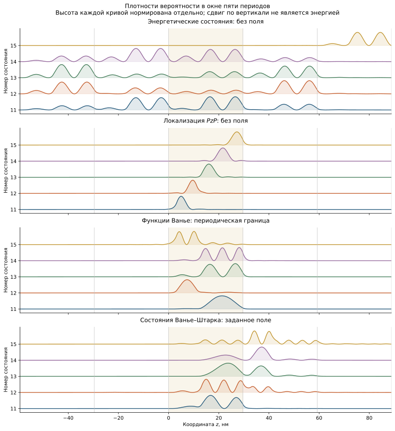
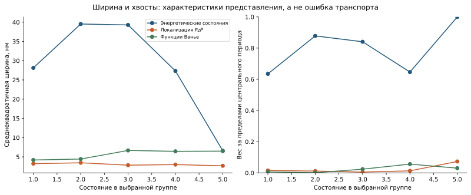
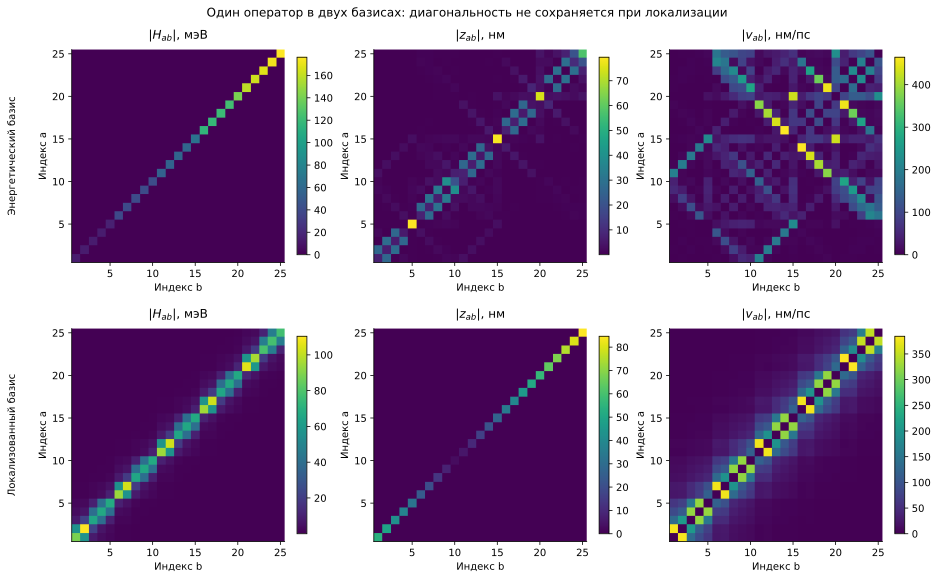

```@meta
CurrentModule = QCLNEGF
```

# [Локализация состояний на реальной структуре reference design](@id localization-demonstration)

Электрон в многослойной структуре описывается волновой функцией, распределённой
по нескольким квантовым ямам. Для расчёта переноса эту функцию удобно разложить
по ограниченному набору базисных функций. Энергетические состояния естественно
описывают спектр, а пространственно локализованные функции позволяют различать
соседние периоды и исследовать туннельную связь между ними. Оба представления
могут описывать одну и ту же физику. Различие возникает, если при переходе к
новому представлению одновременно отбросить хвосты функций, матричные элементы
или часть состояний.

В этой главе преобразование базиса отделено от таких приближений. Все численные
данные получены функциями физического ядра из опубликованной последовательности
слоёв reference design, заданной в `reference_parameters()`. Здесь решается конечномерная
одноэлектронная задача; ток работающего прибора и сходимость полного транспортного
расчёта не определяются. Место одноэлектронной задачи в общей модели раскрыто
в [основах модели](@ref theory-model), а её оператор — в
[главе о базисе](@ref theory-basis).

## [Структура, сетка и границы расчётного окна](@id localization-geometry)

Период длиной ``L_p=29.61`` нм содержит две квантовые ямы GaAs и два барьера
AlGaAs. Высота барьера в используемом наборе параметров равна ``207.75`` мэВ.
Легированный участок расположен внутри второй ямы: его границы не являются
границами разных материалов. Последовательность слоёв и выбранные материальные
параметры приведены в [паспорте структуры](@ref theory-reference2019).


На верхней панели показаны два различных потенциала: край зоны без поля и край
зоны при заданном падении напряжения ``V_p=56`` мВ. Убывание электронной
потенциальной энергии вдоль ``z`` соответствует принятому знаку ``-eFz``.
Ни поле Хартри, ни результат самосогласования в эту панель не включены.
Плотность доноров нормирована дискретно так, чтобы её интеграл по периоду
совпадал с заданной поверхностной плотностью.

Основной опыт использует 96 узлов на период и окно пяти периодов:
``-2L_p<z<3L_p``. Из 480 координатных состояний сохраняются 25 низших состояний.
Пять состояний на период — параметр усечения для демонстрации, а не доказанный
достаточный размер базиса для усиления или тока. Узлы находятся в центрах
ячеек; толщины слоёв считываются из физического пресета, а не подменяются
числами, округлёнными к сетке.

Для энергетического базиса и локализации через оператор координаты на внешних
границах окна используются условия Дирихле. Функции Ванье строятся для
периодически замкнутого окна. Эти задачи имеют разные границы; равенство их
конечных спектров не предполагается. Поле включается только при построении
состояний Ванье–Штарка. Такое разделение позволяет выяснить, какое изменение
вызвано выбором базиса, а какое — другим гамильтонианом или границей.

## [От энергетического подпространства к локализованным функциям](@id localization-pzp)

На координатной сетке строится оператор БенДэниела–Дьюка. Он учитывает
пространственную зависимость эффективной массы и энергетическую ступеньку
между материалами. Диагонализация даёт собственные энергии и ортонормированные
дискретные векторы. Обозначим через ``C`` матрицу, столбцы которой содержат
25 сохранённых векторов. Тогда ``C^\dagger C=I``, а
``P=CC^\dagger`` — проектор на выбранное подпространство.

Координата внутри этого подпространства представляется матрицей

```math
Z_S=C^\dagger\operatorname{diag}(z_g)C.
```

Её собственные векторы образуют унитарную матрицу ``U``. Новые функции
``\Phi=CU`` диагонализуют проекцию координаты ``PzP``. Их средние положения
становятся определёнными собственными значениями ``Z_S``, хотя каждая функция
сохраняет конечную пространственную ширину. Локализация здесь означает
концентрацию вероятности около центра, а не превращение волновой функции в
точечную частицу.

Почему такой выбор уменьшает суммарный разброс? При унитарном повороте внутри
фиксированного подпространства сумма ``\sum_a\langle z^2\rangle_a`` постоянна.
Сумма дисперсий уменьшается, когда увеличивается
``\sum_a\langle z\rangle_a^2``. Для эрмитовой матрицы координаты наибольшая
сумма квадратов диагональных элементов достигается в её собственном базисе.
Это утверждение относится к сумме ширин в заданном конечном подпространстве.
Оно не доказывает оптимальность усечённого базиса для всех транспортных
наблюдаемых.



На всех панелях изображены столбцы 11–15 соответствующего представления.
Вертикальный сдвиг обозначает номер функции, а не её энергию. Высота каждой
кривой нормирована отдельно, чтобы сравнивать форму; для количественного
сопоставления вероятностей предназначены исходные CSV. Таблица огибающих
содержит только изображённые функции, а таблицы метрик и операторов — все
25 состояний каждого представления.

У энергетических функций номер по энергии не задаёт период локализации. Это
хорошо видно на примере состояния 15: в данном конечном окне его центр находится
около ``78.57`` нм, рядом с правой границей. В базисе ``PzP`` столбцы 11–15
имеют центры внутри центрального периода. В выбранной группе состояний
Ванье–Штарка некоторые центры снова лежат за его пределами. Поэтому нельзя
назначать состоянию физический период только по арифметике его индекса.

Функции Ванье получаются преобразованием Блоха: состояния, различающиеся фазой
между соседними периодами, складываются с согласованными фазовыми множителями.
Произвольные скачки фаз собственных векторов между точками волнового вектора
могут сделать сумму искусственно широкой. Реализация согласует соседние
подпространства через полярное разложение их перекрытия и замыкает фазовый
цикл. Основы связи протяжённых и локализованных представлений изложены в
[обзоре функций Ванье](https://arxiv.org/abs/1112.5411); данный пример
использует конкретную одномерную конечную реализацию проекта.

Состояния Ванье–Штарка возникают при наличии постоянного поля. Изменение
потенциальной энергии от периода к периоду препятствует свободному
распространению по бесконечной идеальной сверхрешётке. В конечном окне низшие
по энергии состояния дополнительно чувствуют внешний край потенциала.
Поэтому для полевой задачи особенно необходимы расширение окна и проверка
энергетического отбора. Простое сравнение столбцов с теми же номерами между
нулевым полем и ненулевым полем не является сравнением одной и той же
инвариантной группы состояний.

## [Какие величины измеряют локализацию](@id localization-metrics)

Для нормированной физической огибающей ``\psi_a(z)`` определим центр,
среднеквадратичную ширину и обратную длину участия:

```math
\bar z_a=\int z|\psi_a(z)|^2\,dz,\qquad
\sigma_a^2=\int(z-\bar z_a)^2|\psi_a(z)|^2\,dz,\qquad
I_a=\int|\psi_a(z)|^4\,dz.
```

Последнюю величину часто называют обратным коэффициентом участия. В выбранной
континуальной нормировке она имеет размерность обратной длины. Для плотности,
равномерной на отрезке длины ``L``, получается ``I=1/L``. Таким образом,
``1/I`` характеризует протяжённость состояния, но не является ни длиной
свободного пробега, ни длиной локализации транспортной задачи.

Дискретные векторы ядра удовлетворяют ``\sum_g|\Phi_{ga}|^2=1``. При
равномерной сетке физическая огибающая равна
``\psi_a(z_g)=\Phi_{ga}/\sqrt{\Delta z}``. Именно эта нормировка использована
в CSV: координата измеряется в нм, вероятность — в нм``^{-1}``, а действительная
и мнимая части огибающей — в нм``^{-1/2}``. Связь с внутренними безразмерными
массивами приведена в [главе о масштабировании](@ref theory-scaling).

Ещё одна величина — вес за пределами центрального периода:

```math
T_a=1-\int_0^{L_p}|\psi_a(z)|^2\,dz.
```

Если функция действительно относится к этому периоду, ``T_a`` измеряет
отбрасываемую вероятность при её обрезании. Для функции с центром в другом
периоде большое ``T_a`` ожидаемо и не означает численной ошибки.



Для ``PzP`` на основной сетке получены следующие значения:

| Функция центральной группы | Центр, нм | Ширина, нм | Вес вне периода |
|---:|---:|---:|---:|
| 1 | 5.249 | 3.233 | 0.0152 |
| 2 | 9.637 | 3.455 | 0.0116 |
| 3 | 16.307 | 2.839 | 0.0049 |
| 4 | 21.606 | 2.989 | 0.0130 |
| 5 | 26.884 | 2.681 | 0.0731 |

Точные значения доступны в [таблице метрик](../assets/physics/data/basis_metrics.csv).
Пятый хвост нельзя признать пренебрежимо малым на основании одного этого
рисунка. Даже небольшой вес может существенно менять матричный элемент
между периодами, поскольку такой элемент сам по себе мал. Для функций на
периодическом кольце обычная ширина в координате ``z`` зависит также от выбора
места разреза кольца; центральная группа выбрана вдали от него.

## [Преобразование операторов и проверка неизменности физики](@id localization-operators)

Локализованный базис сам по себе не делает гамильтониан диагональным. После
поворота энергетического базиса возникают внедиагональные элементы,
описывающие когерентную связь функций. Одновременно необходимо преобразовать
оператор координаты, обратную эффективную массу, матрицу плотности и вершины
рассеяния:

```math
O_{\mathrm{loc}}=U^\dagger O_{\mathrm{energy}}U.
```



Скорость в сохранённом инвариантном подпространстве вычисляется через
``v=(i/\hbar)[H,z]``. В энергетическом базисе ненулевая скорость связана
с внедиагональными элементами координаты; в базисе ``PzP`` её структура
определяется связями гамильтониана между различными центрами. Плотность тока
требует дополнительно матрицы заселения и когерентностей и интегрирования по
поперечному движению. Поэтому карта ``|v_{ab}|`` не является картой тока.
Связь операторов с наблюдаемыми рассмотрена в
[главе о плотности и токе](@ref theory-observables).

Для прямой проверки выбирается энергия ``E=73`` мэВ и положительное уширение
``\eta=2`` мэВ. Резольвента вычисляется двумя способами:

```math
G_C=C\big[(E+i\eta)I-E_S\big]^{-1}C^\dagger,
\qquad
G_\Phi=\Phi\big[(E+i\eta)I-H_\Phi\big]^{-1}\Phi^\dagger.
```

Относительное различие ``\|G_C-G_\Phi\|/\|G_C\|`` в воспроизводимом опыте
составляет около ``2.3\times10^{-14}``. Здесь сравниваются одно и то же
подпространство, тот же гамильтониан и те же границы. Численная проверка
допускает ``10^{-10}`` с учётом различий библиотек линейной алгебры. Полученное
равенство подтверждает корректность преобразования; оно не измеряет ошибку
отбора 25 состояний относительно полного координатного пространства.

Ветвь `build_multiperiod_reference_basis` сохраняет хвосты и все связи внутри
окна. Возвращаемый объект намеренно отличается от однопериодного `BasisData`.
Его нельзя подставить в однопериодные операторы рассеяния без согласованного
переноса всех интегралов и граничных условий. Однопериодное обрезание с
последующей ортогонализацией Лёвдина является отдельным приближением,
подробно рассмотренным в [главе о базисе](@ref theory-basis).

## [Последовательность самостоятельного опыта](@id localization-reproduction)

Постройте `PhysicalParameters`, сетки и профили; вызовите `build_bdd_hamiltonian`
и `build_localized_basis`. Сравните собственные невязки, ортогональность,
центры и разбросы локализованных состояний. Меняйте число состояний и ширину
многопериодного окна отдельно, сохраняя одни и те же физические параметры.

Числовые входы рисунков расположены в `docs/src/assets/physics/data`.
Это учебные иллюстрации координатных операторов, не результат полного
самосогласованного транспорта. Функции построения графиков предоставляет
[QCLNEGFRunner.jl](https://github.com/AfonenkoA/QCLNEGFRunner.jl).
