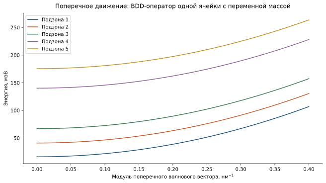
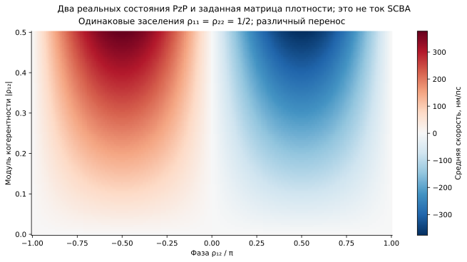

```@meta
CurrentModule = QCLNEGF
```

# [Атлас физических функций и операций](@id physical-atlas)

Численный расчёт квантово-каскадной структуры связывает несколько видов
описания. Геометрия задаёт одноэлектронные состояния, функции Грина описывают
доступные и занятые состояния, рассеяние изменяет их энергии и времена жизни,
а электрический заряд изменяет потенциал. Наблюдаемые ток и оптический отклик
получаются из согласованного решения этих связанных задач.

Назначение атласа — научиться читать каждую из этих величин отдельно и
понимать, какие выводы из неё следуют. Фигуры воспроизводятся примером
числовыми таблицами в `docs/src/assets/physics/data`.
Исходные таблицы сохраняются в открытом текстовом формате CSV; тяжёлые
файлы HDF5 для воспроизведения атласа не нужны. Команды приведены в
[практикуме по локализации](@ref localization-reproduction).

У иллюстраций различный физический статус, который необходимо сохранять при
их использовании. Профили структуры, состояния, матрицы и дисперсии
вычислены операторами ядра для реальной геометрии. Спектральная карта использует
заданные уширение и равновесное заполнение; решение Пуассона использует
заранее заданный нейтральный заряд. Оптическая линия, зависимость переноса от
когерентности и скалярные итерации показывают отдельные механизмы. Ни одна
из этих фигур не выдана за самосогласованный рабочий режим reference design.

## [От профиля материалов к подзонам](@id atlas-dispersion)

Вдоль оси роста ``z`` электрон удерживается последовательностью квантовых
ям, поэтому его движение описывается набором квантованных состояний. В
плоскости слоёв сохраняется поступательное движение с волновым вектором
``\mathbf k_\parallel``. Каждому продольному состоянию соответствует подзона:
энергия зависит от модуля этого волнового вектора.

При постоянной массе получается парабола
``E_a(k_\parallel)=E_a(0)+\hbar^2k_\parallel^2/(2m_\parallel)``.
В гетероструктуре масса зависит от материала, поэтому сначала к координатному
оператору добавляется ``\hbar^2k_\parallel^2/[2m_\parallel(z)]``, а затем
диагонализуется весь оператор. Функции разных подзон могут при этом немного
изменяться вместе с ``k_\parallel``.



На рисунке использованы условия Дирихле для одной ячейки без электрического
поля. Он демонстрирует вклад поперечного движения, а не зонный спектр
бесконечной периодической структуры вдоль ``z``. Продольное межпериодное
движение вводится отдельно через связь периодов; см.
[главу о периодичности](@ref theory-periodicity).

Край зоны, массы и доноры показаны в
[практикуме по геометрии](@ref localization-geometry). Огибающие и
пространственные центры приведены в [опыте по локализации](@ref localization-pzp).
Переход между энергетическим и локализованным описанием не изменяет физический
оператор, если вместе с функциями преобразованы все его матричные элементы.

## [Спектральная функция и занятость](@id atlas-spectral)

Запаздывающая функция Грина описывает отклик электронного состояния на
возмущение, действовавшее раньше момента наблюдения. Для сохраняемого
одноэлектронного подпространства и заданного положительного уширения она равна

```math
G^R(E)=\big[(E+i\eta)I-H\big]^{-1}.
```

Вещественная часть знаменателя определяет положение резонанса, а положительная
``\eta`` помещает его полюс в нижнюю полуплоскость комплексной энергии.
Спектральная матрица ``A=i(G^R-G^A)`` показывает, где существуют доступные
электронные состояния. Для эрмитова гамильтониана и положительной ``\eta``
она положительно полуопределена.

Локальная плотность состояний получается проекцией на координату:

```math
\nu(z,E)=\frac{A(z,z;E)}{2\pi}
=\sum_j |\psi_j(z)|^2\,
\frac{\eta/\pi}{(E-E_j)^2+\eta^2}.
```

Здесь ``\nu`` имеет единицы ``(\text{мэВ}\cdot\text{нм})^{-1}``.
Лоренцевы пики выражают выбранное уширение отдельных состояний. Его величина
``2`` мэВ задана для рисунка и не получена из расчёта рассеяния. На бесконечной
энергетической оси интеграл каждого такого пика равен единице. В конечном
окне энергий часть его хвоста неизбежно отсутствует; кроме того, сохранённое
подпространство содержит только 25 состояний.


Левая панель показывает доступные состояния. Правая дополнительно умножена
на функцию Ферми
``f(E)=[1+\exp((E-\mu)/(k_BT))]^{-1}``
при выбранных ``\mu=60`` мэВ и ``T=200`` K. Общая логарифмическая цветовая
шкала позволяет увидеть одновременно основные максимумы и слабые хвосты.
Состояния с энергией ниже химического потенциала заполнены сильнее,
хотя доступный спектр в обеих панелях один и тот же.

Это равновесное заполнение только для демонстрации. В рабочем режиме ККЛ
электроны переносятся через структуру, и корреляционная матрица
``D=-iG^<`` находится из уравнения Келдыша. Её нельзя в общем случае заменить
произведением ``fA`` с одной общей функцией Ферми. Более того, показанная
карта относится к продольной задаче при ``k_\parallel=0``: она ещё не
содержит интеграла по поперечному импульсу и спиновой кратности. Поэтому
её энергетический интеграл не следует трактовать как объёмную электронную
плотность в м``^{-3}``. Полная нормировка дана в
[главе о функциях Грина](@ref theory-greens) и
[главе о наблюдаемых](@ref theory-observables).

## [Перенос и когерентность](@id atlas-current)

Заселение состояния задаётся диагональным элементом матрицы плотности.
Внедиагональный элемент описывает когерентность — определённую относительную
амплитуду и фазу между двумя состояниями. Она необходима для описания
туннельного переноса в выбранном локализованном базисе.

Средняя скорость определяется полным выражением ``\langle v\rangle=
\operatorname{Tr}(\rho v)``. Если изменить только фазу внедиагонального
элемента ``\rho_{12}``, сохраняя заселения ``\rho_{11}=\rho_{22}=1/2``,
то скорость может изменить знак. Для такой двухуровневой матрицы условие
положительности требует ``|\rho_{12}|\leq1/2``. За пределами этой области
на рисунке нет физически допустимых состояний.



Оператор скорости взят из двух центральных функций ``PzP`` реальной
структуры, а матрица плотности задана как учебный параметр. Показана
скорость в нм/пс. Электронный ток потребовал бы ещё заряда ``-e``, плотности
носителей и согласованной пространственной нормировки. На практике ток
также проверяют через границы периодов и балансы столкновений, а не только
одним средним значением. Причина таких проверок разобрана в
[главе о токе и балансах](@ref theory-observables).

## [Пространственные факторы рассеяния](@id atlas-scattering)

При рассеянии изменяется состояние электрона, и часть импульса передаётся
возмущению кристалла. Даже одинаковое по природе взаимодействие действует
на различные состояния по-разному: электронные огибающие могут сильно
перекрываться, пространственно расходиться или иметь компенсирующие знаки.
Эта геометрия входит в продольный форм-фактор

```math
F_{ab}(q_z)=\int\psi_a^*(z)e^{iq_zz}\psi_b(z)\,dz.
```

Для ортонормированных функций ``F_{ab}(0)=\delta_{ab}``. При ненулевом
``q_z`` фазовый множитель меняется вдоль структуры, и интеграл уже не
сводится к обычному перекрытию. Форма зависимости ``|F_{ab}(q_z)|^2``
показывает, какие передачи продольного импульса эффективнее связывают
выбранную пару состояний.


Левая панель вычислена для полных огибающих ``PzP``. Средняя панель
показывает отдельно нормированный знаменатель экранированного
взаимодействия ``q_s^2/(q^2+q_s^2)`` и фурье-образ гауссовой
корреляции шероховатости ``\exp(-q^2\Lambda^2/4)``. Здесь ``q``
во второй панели относится к соответствующему передаваемому импульсу,
а не автоматически к ``q_z`` первой панели. Эти множители имеют разные
физические роли; их нельзя принять за готовые скорости рассеяния или
перемножить без полного интеграла конкретного механизма.

Правая панель поясняет различие испускания и поглощения продольного
оптического фонона. Среднее число фононов энергии ``\hbar\omega_{LO}``
равно ``N_{LO}=[\exp(\hbar\omega_{LO}/k_BT_{LO})-1]^{-1}``.
Поглощение требует уже существующего фонона и имеет вес ``N_{LO}``.
Испускание возможно и в отсутствие возбуждённых фононов, поэтому его вес
равен ``N_{LO}+1``. Полные электронные скорости дополнительно зависят
от доступности конечного состояния, заселения и матричного элемента.
В спектральных уравнениях эти процессы связывают энергии, разнесённые
на ``\hbar\omega_{LO}``.

Акустические фононы и беспорядок состава сплава имеют другие корреляторы,
а электрон-электронное взаимодействие — другое замыкание задачи. Их нельзя
свести к замене одного множителя на этом рисунке. Интегралы и область
применимости каждого механизма раскрыты в
[главе о ядрах рассеяния](@ref theory-kernels).

## [Поле Хартри как отклик на заряд](@id atlas-hartree)

Ионизованные доноры несут положительный заряд, а электроны — отрицательный.
Если их локальные плотности различны, возникает электростатический
потенциал ``\varphi_H``. Потенциальная энергия электрона имеет противоположный
знак: ``U_H=-e\varphi_H``. Поэтому электронное скопление и положительный
донорный заряд изменяют электронную энергию в разных направлениях.

Периодическое уравнение Пуассона допускает решение только для нейтрального
периода: интеграл ``N_D^+-n`` должен равняться нулю. Сам потенциал определён
с точностью до константы, поэтому дополнительно фиксируется его среднее.
Эти два условия имеют разный смысл: нейтральность относится к источнику,
а фиксация среднего — к выбору нуля энергии.


Для рисунка взята положительная смесь плотностей пяти реальных центральных
функций ``PzP`` с весами ``0.40,0.30,0.15,0.10,0.05``. После ограничения
на один период смесь нормирована на полную поверхностную плотность доноров.
Это специально заданное нейтральное распределение, а не результат
уравнения Келдыша. Затем один раз вызвано `solve_periodic_poisson`.

Невязка дискретного уравнения в опыте составляет около
``4.3\times10^{-14}``, а среднее ``U_H`` равно нулю в пределах округления.
Такой результат проверяет решение линейной электростатической задачи.
Он не доказывает самосогласованность: чтобы её получить, нужно заново
вычислить электронное распределение в изменённом потенциале и повторять
связанный процесс. Этот внешний цикл описан в
[главе об уравнении Пуассона](@ref theory-outer-loop).

## [Собственная энергия и сходимость итераций](@id atlas-scba)

Собственная энергия ``\Sigma^R`` обобщает действие взаимодействий и
окружения на одноэлектронное распространение. Её вещественная часть
сдвигает положение спектральных особенностей, а матрица
``\Gamma=i(\Sigma^R-\Sigma^A)`` описывает уширение. Для скалярного
причинного полюса ``\Sigma^R=g^2/(E-E_0+i\gamma)`` величина
``\Gamma=-2\operatorname{Im}\Sigma^R`` положительна.


В левой панели вещественная и мнимая части происходят из одной аналитической
функции. Они не могут независимо назначаться произвольными кривыми:
причинность связывает их преобразованием Гильберта. В реальном расчёте
конечное энергетическое окно и продолжение за его пределами влияют на
численное восстановление этой связи.

Правая панель использует учебную скалярную модель самосогласованного
борновского приближения:

```math
\Sigma_{\mathrm{cand}}=\frac{w^2}{E+i\eta-\Sigma_n},\qquad
\Sigma_{n+1}=(1-\alpha)\Sigma_n+\alpha\Sigma_{\mathrm{cand}},
\qquad
r_n=\frac{|\Sigma_{\mathrm{cand}}-\Sigma_n|}{w}.
```

Здесь ``E=0.2``, ``\eta=0.06`` и ``w=0.8`` безразмерны и выбраны
для иллюстрации. Коэффициент смешивания ``\alpha`` регулирует изменение
за один шаг. При слишком резком обновлении отрицательная обратная связь
может вызывать чередование ошибок и медленное затухание; умеренное
смешивание в этом примере уменьшает число итераций. Универсально лучшего
``\alpha`` из такого опыта получить нельзя.

График построен для невязки исходного уравнения неподвижной точки,
а не только для разности уже смешанных приближений. Иначе уменьшение
``\alpha`` само по себе создавало бы видимость сходимости. Горизонтальная
линия ``10^{-8}`` служит учебным ориентиром и не заменяет совокупность
критериев реального расчёта: причинность, положительность, нейтральность
и балансы должны проверяться отдельно. См.
[самосогласованный цикл](@ref theory-scba) и
[критерии валидации](@ref theory-validation).

## [От дипольного перехода к усилению](@id atlas-optical)

Электрическое поле света вдоль оси роста связывает состояния через
матричный элемент координаты ``z_{12}=\langle1|z|2\rangle``.
Ненулевой дипольный элемент означает возможность межподзонного перехода,
но сам по себе не означает усиления. Для усиления стимулированное
испускание должно превышать поглощение, что в простой двухуровневой
модели определяется разностью заселений верхнего и нижнего уровней.


Расстояние между двумя первыми уровнями отдельной ячейки и дипольный элемент
вычислены из реального координатного гамильтониана:
``\Delta E\simeq24.85`` мэВ и ``|z_{12}|\simeq2.24`` нм.
Эти уровни получены для одной ячейки без поля; они не объявляются рабочей
лазерной парой reference design. Для иллюстрации выбрана полуширина ``\gamma=2`` мэВ
и построена безразмерная линия

```math
g_{\mathrm{rel}}(\hbar\omega)=
(n_2-n_1)\frac{\gamma^2}{(\hbar\omega-\Delta E)^2+\gamma^2}.
```

Её знак меняется вместе с инверсией, а ширина определяется заданным
``\gamma``. Абсолютный коэффициент усиления требует нормировки плотностей,
дипольного веса, частоты, показателя преломления и полного линейного отклика.
В неравновесной многоподзонной задаче форма линии также изменяется
когерентностями и энергозависимым рассеянием. Реализованное приближение
и ограничения изложены в [главе об оптическом отклике](@ref theory-optical-response).

## [Как переносить эти изображения на рабочий расчёт](@id atlas-production-reading)

Для рабочего расчёта те же виды графиков строятся из его фактических
данных. Подпись должна сообщать рабочую точку, номер внешней и внутренней
итерации, базис и статус сходимости. Численные картинки без этих условий
не позволяют сравнить два расчёта.

| Физическая величина | Представление | Что проверять при чтении |
|---|---|---|
| Край зоны, Хартри, огибающие | Общая координатная ось; отдельно энергия и нормировка вероятностей | Какие поле, итерация и граничные условия использованы |
| Матрицы ``H,z,v,\rho`` | Карты элементов с единицами; модуль и фаза по отдельности | Один ли базис и порядок состояний в сравниваемых картах |
| ``A(z,E),D(z,E)`` | Карты энергии и координаты с согласованной цветовой шкалой | Конечное окно, потерянные хвосты, неотрицательность диагоналей |
| Поперечное движение | Дисперсии и вклады по ``k_\parallel`` | Достаточны ли край сетки и квадратурные веса |
| Факторы рассеяния | Переданный импульс, температура, энергетические сдвиги | Полное ли это ядро либо только его отдельный множитель |
| Электронная плотность и доноры | Общая шкала объёмной плотности, интеграл по периоду | Нейтральность и наличие когерентных вкладов в реконструкции |
| Ток | Профиль по ``z``, спектральное распределение, вольт-амперная характеристика | Постоянство стационарного тока и баланс между механизмами |
| Оптический отклик | Частота или энергия фотона; усиление и поглощение | Нормировка, знак, диполи, заселения и используемое приближение |
| Самосогласование | Логарифмические невязки по номеру итерации | Невязка уравнения, а не только малый смешанный шаг |

Кривые тока и усиления работающего устройства требуют завершённого
транспортного решения. Их здесь не заменяют синтетическими данными.
Связь этих представлений с отчётом и сохранением промежуточных величин
описана в [главе о визуализации](@ref theory-visualization).

Последовательное введение физических моделей и сопоставление приближений
можно продолжить по [обзору Jirauschek и Kubis](https://arxiv.org/abs/1412.3563).
Связь неравновесных функций Грина, переноса и линейного оптического отклика
рассмотрена в [работе Lee и Wacker](https://arxiv.org/abs/cond-mat/0212059).
